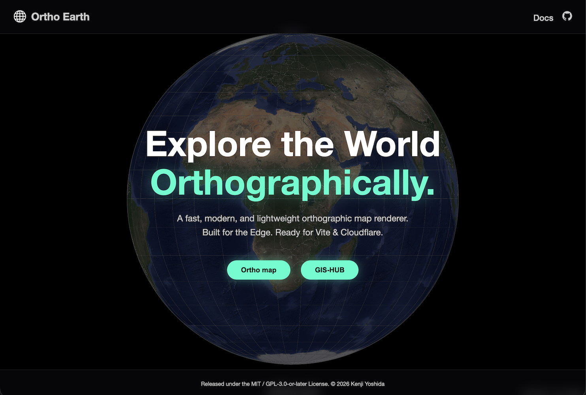

<h1> Ortho Earth</h1>

A serverless WebGPU/GL2 orthographic map engine and GIS workstation, built from scratch — zero dependencies, no tile servers. Runs entirely in the browser.

**top page:** [www.ortho-earth.com](https://www.ortho-earth.com)

**ortho-japan (flagship 3D map):**  [www.ortho-earth.com/japan](https://www.ortho-earth.com/japan/)

**GIS-HUB(apps):**  [www.ortho-earth.com/gishub](https://www.ortho-earth.com/gishub/)

**technical documents:**  [www.ortho-earth.com/#technologies](https://www.ortho-earth.com/#technologies)

## Contributors & Acknowledgments

This project is fully engineered and conceptualized by Kenji Yoshida.
I also acknowledge the invaluable support of my AI collaborators:

- **Claude** (Anthropic) & **Gemini** (Google) - AI Collaborators for architectural ideation, coding, and technical writing.

## License

MIT / GPL-3.0-or-later
