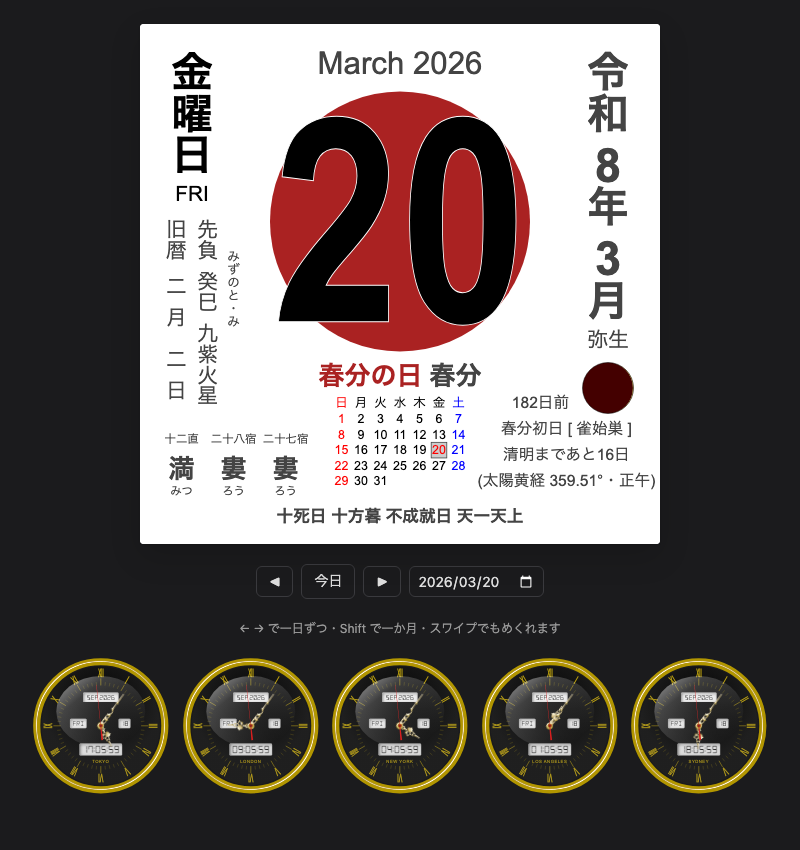

# himekuri — 日めくりカレンダーと世界時計

旧暦・六曜・二十四節気・七十二候・暦注・祝日を一枚に載せた日めくりカレンダーと、アナログの世界時計です。どちらも SVG で描き、ランタイムの依存はありません。

*A Japanese tear-off calendar (lunisolar date, rokuyō, 24 solar terms, 72 pentads, almanac notes, national holidays) and an analog world clock, drawn as SVG with no runtime dependencies.*



## 載っているもの

- **日付**：曜日、元号（明治〜令和）、和風月名、今日からの日数、その月の月カレンダー
- **旧暦**：旧暦の月日（閏月つき）、六曜、月相
- **干支と九星**：日の干支とその読み、日家九星
- **太陽の位置**：二十四節気と雑節（節分・彼岸・八十八夜・入梅・半夏生・土用 ほか）、七十二候、前後の節気までの日数、太陽黄経
- **暦注**：十二直、二十八宿、二十七宿、選日と暦注下段（一粒万倍日・天赦日・不成就日・三隣亡 ほか）
- **祝日**：1948 年の祝日法施行以降の変遷（成人の日の移動、4/29 の改称、体育の日→スポーツの日、振替休日の 2007 年改正、国民の休日、皇室行事・五輪の特例）
- **説明**：各項目にカーソルを乗せると説明の吹き出しが出ます（タッチでも出ます）

## 使い方

```sh
npm install
npm run dev      # デモ（日送り・← → キー・スワイプ・?d=2026-03-20 で日付指定・5 都市の世界時計）
```

```js
import { 日カレンダー, 世界時計, tip } from "himekuri";

// 日めくり：[年, 月, 日] を渡すと SVG の文字列が返る
const page = document.querySelector("#page");
page.innerHTML = 日カレンダー([2026, 3, 20]);
tip(page);                 // page の中の説明を吹き出しで出す（一度呼べばよい）

// 世界時計：<svg> 要素が返る
const clock = 世界時計({ offset: "America/New_York", label: "NEW YORK" });
document.querySelector("#clock").append(clock);
clock.zone("Europe/London");   // タイムゾーンを変える（時差の数値でも可：9 など）
clock.set({ face: 1, hand: 0 }); // 見た目を変える
clock.stop(); clock.start();
```

世界時計はフォントの CSS を `import` するので、Vite などのバンドラ経由で使ってください。

### 世界時計のオプション

| 名前 | 既定 | 内容 |
|---|---|---|
| `offset` | `9` | 時差（時間）または IANA タイムゾーン名。IANA 名なら夏時間も反映 |
| `label` | `""` | 文字盤の下に出す都市名など |
| `face` | `0` | 数字：0 = ローマ数字、1 = アラビア数字、2 = 点と棒 |
| `hand` | `1` | 針：0 = 細い棒、1・2 = 飾り針 |
| `gauge` | `true` | 分の目盛り |
| `digital` | `true` | 液晶表示（年月・曜日・日・時刻） |
| `fg` / `bg` | `#b29600` / `#050505` | 枠・針・文字の色 / 文字盤の色 |
| `dfg` / `dbg` | `#222` / `#eee` | 液晶の文字色 / 背景色 |

### 個別の計算

各ファイルを直接読み込めます。

```js
import { 年間休日, 月間休日 } from "himekuri/休日.js";   // その年・その月の祝日
import { 旧暦計算 } from "himekuri/旧暦.js";            // 旧暦 { 年, 月, 日, 閏 }
```

## 精度と範囲

- **旧暦**：1999〜2051 年は月の表を持っています。
  - 2000〜2030 年は元の表のままです。
  - 1999 年と 2031〜2051 年は、朔と中気から天保暦法（冬至を含む月を 11 月とし、冬至から冬至までに 13 か月あれば最初の中気のない月を閏月にする）で求めました。
  - 同じ計算で 2000〜2030 年を求めると、元の表と閏月を含めて全月一致します。
  - 2033 年は閏 11 月です（いわゆる 2033 年問題）。
  - 表の外の年は同じ計算で求めます。
- **太陽と月の位置**：高野式の級数を使っています。節気と候の日は「その日の 24 時（日本時）までに越えたか」で数えます。
- **九星**：遁甲の切り替え表が 1989〜2050 年です。
- **時刻**：暦の計算は日本時（UTC+9）です。

## ライセンス

- コード：MIT（[LICENSE](LICENSE)）
- 同梱フォント DSEG7 / DSEG14：© keshikan、SIL Open Font License 1.1（[src/assets/fonts/LICENSE-DSEG.txt](src/assets/fonts/LICENSE-DSEG.txt)）
