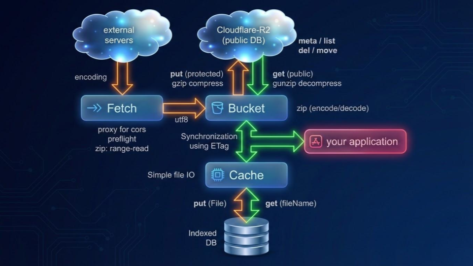

# native-bucket.js (v1.0.0)

A high-performance bridge between **Cloudflare Edge (R2/Workers)** and **Browser Storage (IndexedDB)**. Optimized for handling heavy binary datasets (GIS, archives, large assets) with zero-latency interaction.

[](https://dash.cloudflare.com/)
[](<https://vitejs.dev/>)
[](https://opensource.org/licenses/MIT)


---

## 🏗 System Architecture


*Orchestration of data flow across Remote Servers, Edge Proxies, R2 Buckets, and Local Persistent Cache.*

---

## 🎮 **Demo** [👉 View Live Demo](https://kenjiyoshidahome2026-bit.github.io/native-bucket/demo/)

Experience the zero-latency data flow and surgical ZIP extraction in action.

---

## 🚀 Server-Side Setup ([Cloudflare Workers](https://dash.cloudflare.com))

### 1. Configuration (`wrangler.toml`)

(Sign-up and) deploy the backend to handle R2 operations and Proxy requests. The `index.js` automatically manages CORS for you.
Please edit the file: "wrangler.toml" under "worker" directory.

```toml
name = "native-bucket-api"
main = "index.js"
compatibility_date = "2026-04-01"

[[r2_buckets]]
# [DO NOT CHANGE] Internal binding for the library
binding = "MY_BUCKET"
# [REQUIRED] Your actual R2 bucket name
bucket_name = "my-r2-storage" # <=== change here

[vars]
# [WHITELIST] Comma-separated domains (Suffix matching supported)
# Example: "ortho-earth.com,localhost:5173" allows all subdomains of ortho-earth.
ALLOWED_DOMAINS = "ortho-earth.com,localhost:5173" # <=== change here
```

### 2. Deployment with bash in console

```bash
bash
cd workers
npx wrangler deploy
```

---

## 🛠 Client-Side Setup

### Option A: ESM (Modern Bundlers)

```javascript
import nativeBucket from './src/index.js';
```

### Option B: CDN / Global Script (The Easiest Way)

The library automatically attaches to `window.nativeBucket` (or `self.nativeBucket`) for non-ESM or direct HTML environments.

```html
<script type="module" src="https://cdn.jsdelivr.net/gh/kenjiyoshidahome2026-bit/native-bucket@main/dist/native-bucket.iife.js"></script>
<script>
  window.addEventListener('load', () => { // Access via global nativeBucket after page load
    const { Fetch, Bucket, Cache } = nativeBucket("https://your-worker.dev/");
    ...
   });
</script>
```

---

## 📖 Detailed API Reference

### Initialization

Register your Worker endpoint to unlock the three core modules.

```javascript
const { Fetch, Bucket, Cache } = nativeBucket("https://your-worker.workers.dev/");
```

### 🌐 `Fetch(url, options)`

A smart proxy that bypasses CORS and can surgically extract specific files from remote ZIP archives.

| Parameter | Type | Description |
| :--- | :---: | :--- |
| `type` | String | Output format: `"file"` (Default), `"blob"`, `"json"`, `"text"`. |
| `cors` | Boolean | true/false: pre-flight check without this parameter |
| `target` | String | Path inside the ZIP to extract a specific file. |
| `encoding` | String | encoding (default:`"utf8"`) |
| `silent` | Boolean | if true then no progress log |
| `eventTarget` | dom | target of event (default: window or self[webWorker]) |

```javascript
// get en entire renote zip file
const zip = await Fetch("https://server.com/data.zip");
console.log(`Received: ${zip.name} (${zip.size} bytes)`);

// Extract a file from remote ZIP as JSON widthout pre-flight.
const json = await Fetch("https://server.com/data.zip", { target: "layers/japan.geojson" ,cors:true, type:"json"});
console.log(`Received: `, json);
```

### 🪣 `Bucket(directory, options)`

High-level interface for Cloudflare R2. Features automatic Gzip detection and parallelized Multipart uploads for files >5MB.

| Parameter | Type | Description |
| :--- | :---: | :--- |
| `silent` | Boolean | if true then no progress log |
| `eventTarget` | dom | target of event (default: window or self[webWorker]) |

```javascript
const storage = await Bucket("v1/geodata");
const file = new File(["This is a file"], "test.txt", {type:"text/plain"});

// Upload a File object (Auto-handles multipart if large)
await storage.put(file);

// Download as a File object (Auto-decompressed if Gzipped)
const file = await storage.get("test.txt");

// get meta information from the File. (size, ETag etc.)
const meta = await storage.meta("test.txt");

// Rename file
await storage.move("test.txt", "text.old.txt");

// delete file
await storage.del("text.old.txt");

// List items in the directory
const list = await storage.list();

// read a zip file as file array
const files = await storage.gets("name");

// put a zip file from file array
await storage.puts(fileArray);
```

### ⚡ `Cache(dbName/tableName)`

A persistent Key-Value file store powered by IndexedDB. Perfect for instant subsequent loads with **ultra-low latency**. For categorization, several tableNames can be assigned to the one same dbName. This cace, the version of indexedDB will be incremented automatically, and users dont't need take care of "onupgradeneeded".

```javascript
// open the database with "dbName/tableName"
const local = await Cache("assets/v1");

// List names in database
const list = await local();

// Load the File object instantly (Getter)
const file = await local("tile_01");

// Save a File locally (Setter)
await local(file); // or await local(file.name, file);

// Delete a File locally
await local("tile_01", null);
```

---

## 🔒 Security: Suffix-Matching Whitelist

Access is strictly enforced via the `ALLOWED_DOMAINS` whitelist in `wrangler.toml`.

- **`ortho-earth.com`** matches `ortho-earth.com`, `www.ortho-earth.com`, `dev.ortho-earth.com`, etc.
- **`localhost:5173`** allows access from your local dev-server.

---

## 📄 License

(c) 2026 Kenji Yoshida. Released under the **MIT License**.
